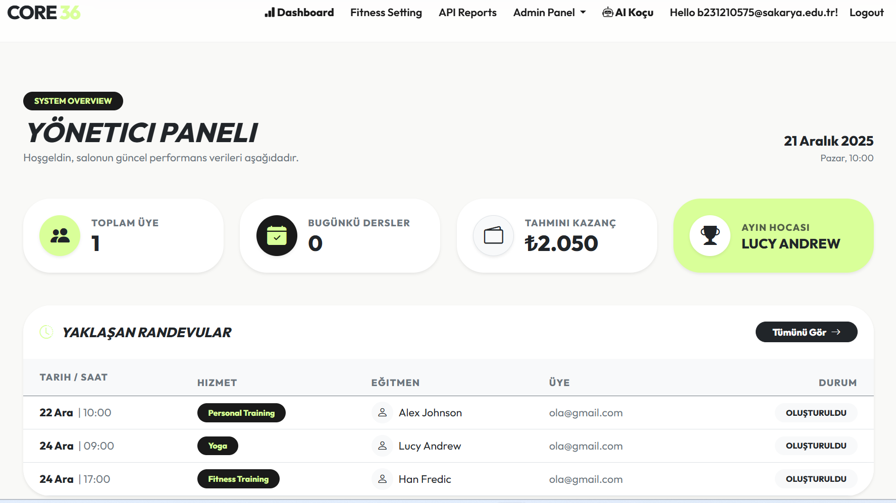
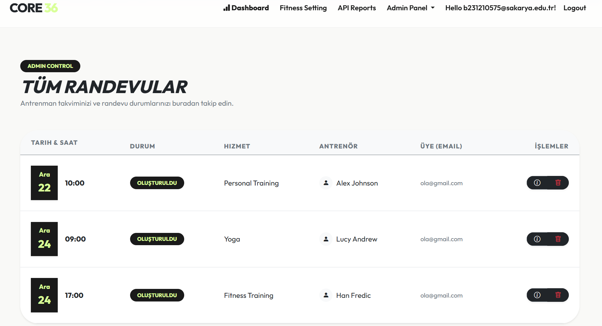
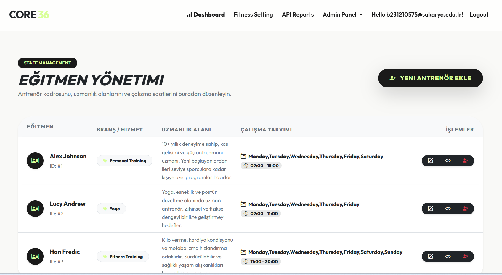
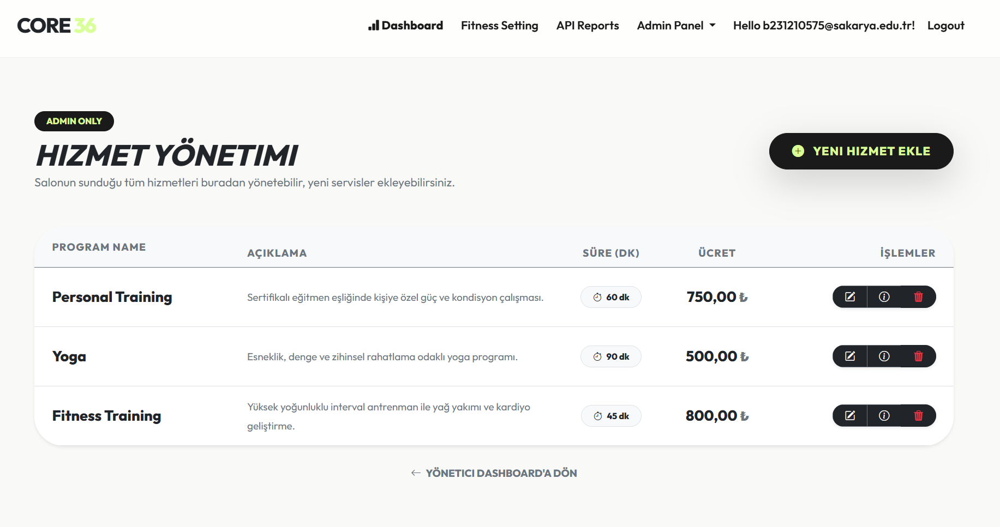
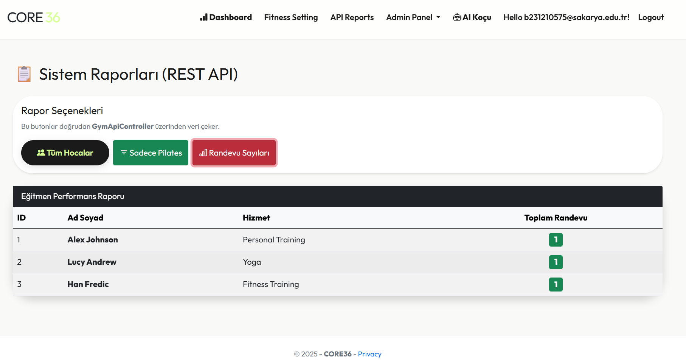
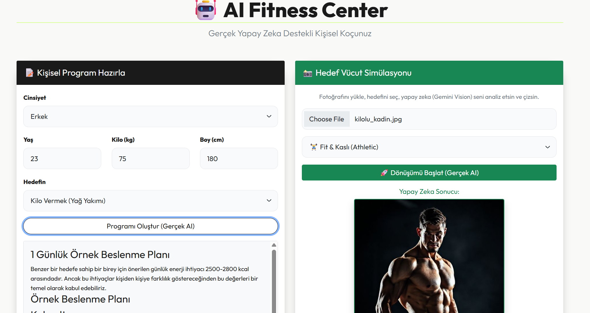

# Fitness Center Management System

Fitness Center Management System is a web-based application developed with **ASP.NET Core MVC** to manage the main operations of a fitness center.

The system provides features for user authentication, appointment scheduling, trainer management, service management, dashboard overview, reporting, and AI-supported fitness recommendations.

> This project was developed as a Web Technologies course project.

---

## Project Overview

The main purpose of this project is to digitalize fitness center operations in a structured web application.

The system allows members to register, log in, view services, and create appointments. Admin users can manage trainers, services, appointments, reports, and dashboard data.

The project focuses on applying MVC architecture, database management, authentication, authorization, CRUD operations, and dynamic web application development using ASP.NET Core.

---

## Technologies Used

### Backend

- ASP.NET Core 8.0 MVC
- Entity Framework Core
- Microsoft SQL Server
- ASP.NET Core Identity
- LINQ
- Code First Migration

### Frontend

- HTML5
- CSS3
- Bootstrap 5
- JavaScript
- jQuery
- AJAX
- Bootstrap Icons

### AI Integration

- Groq Llama-3 API
- AI-supported fitness and nutrition recommendation feature

---

## Main Features

### User Authentication

The system includes user registration and login functionality using ASP.NET Core Identity.

Users can create accounts and access the system according to their role.

### Role-Based Access

The project supports different user roles.

Admin users can manage system data, while members can use appointment and fitness-related features.

### Appointment Management

Members can create and manage fitness appointments through the system.

Admins can view and manage appointment records.

### Trainer Management

Admin users can add, update, view, and delete trainer information.

This helps the fitness center keep trainer records organized.

### Service Management

Fitness services can be managed by admin users.

Service information such as service name, price, and related details can be stored and updated.

### Dashboard

The dashboard provides a general overview of the system.

It helps admins monitor important information such as members, appointments, services, and system activity.

### Reports

The reporting section supports system tracking and helps admins review important fitness center data.

### AI-Supported Recommendation

The project includes an AI-supported recommendation feature.

This feature provides fitness and nutrition suggestions based on user input.  
It is included as an additional module, while the main focus of the project remains fitness center management.

---

## Website's Screenshots

### Dashboard

### Appointment Management

### Trainer Management

### Service Management

### Reports Page (API)

### AI Coach

---
